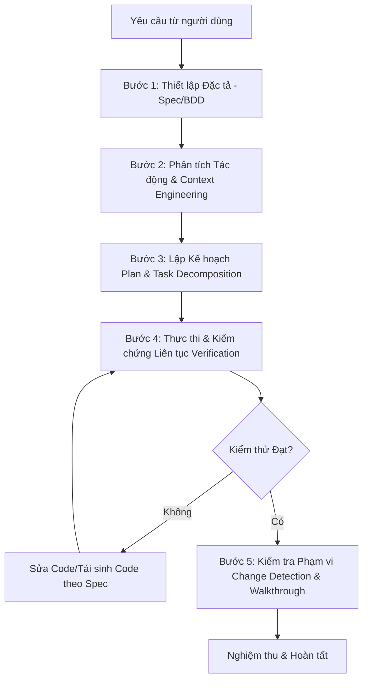

# Quy Trình Phát Triển Dựa Trên Đặc Tả (Spec-Driven Production-Grade Development Workflow)

> **Tài liệu Tham Chiếu Cốt Lõi:** Dựa trên phương pháp luận *"Spec-Driven Production Grade Development in the Age of Vibe Coding"* (Google & Kaggle AI Agents Intensive Course).
> **Quy định:** Tất cả các Session làm việc mới từ nay về sau BẮT BUỘC phải tuân thủ tuyệt đối quy trình 5 bước dưới đây cho mọi yêu cầu phát triển hoặc chỉnh sửa phần mềm.

---

## 🎯 Triết Lý Cốt Lõi (Core Principles)

1. **Code là tài sản tạm thời & có thể thay thế (Disposable Code):** Code do AI sinh ra không phải là thứ cố định. Nếu code không đạt kiểm thử hoặc không khớp đặc tả, code đó sẽ bị loại bỏ và sinh lại.
2. **Đặc tả là nguồn chân lý duy nhất (Spec as Source of Truth):** Đặc tả kỹ thuật (Spec / PRD / Gherkin BDD / API Contracts) là tài sản vĩnh viễn. Mọi quyết định thiết kế và mã nguồn phải tuân theo đặc tả.
3. **Thực thi dựa trên kiểm chứng (Verification-Driven Execution):** Không tuyên bố hoàn thành khi chưa chạy thực tế và đưa ra bằng chứng kiểm thử thành công (Zero-Trust Verification).

---

## 🔄 Quy Trình 5 Bước Bắt Buộc (The 5-Step SDD Workflow)

---

### 📋 BƯỚC 1: XÁC ĐỊNH Ý ĐỊNH & THIẾT LẬP ĐẶC TẢ (SPECIFICATION & INTENT)
- **Tuyệt đối KHÔNG nhảy vào viết code ngay ("Vibe Coding").**
- Với mọi yêu cầu mới (tính năng, refactor, sửa lỗi lớn), phải làm rõ và tạo/cập nhật tài liệu Đặc tả Kỹ thuật (`specs/` hoặc `implementation_plan.md`):
  - **Mục tiêu & Ngữ cảnh (Goal & Context):** Mô tả chi tiết tính năng và giá trị mang lại.
  - **Kịch bản BDD / Gherkin Syntax:** Định nghĩa cụ thể các case sử dụng dạng:
    - `Given` (Tiền điều kiện hệ thống/dữ liệu)
    - `When` (Hành động kích hoạt từ người dùng hoặc hệ thống)
    - `Then` (Kết quả đầu ra kỳ vọng)
  - **Hợp đồng API & Schema:** Khai báo kiểu dữ liệu, các hàm/endpoint liên quan, ràng buộc dữ liệu.
  - **Tiêu chí chấp nhận (Acceptance Criteria & Non-functional Requirements):** Hiệu năng, trải nghiệm người dùng, khả năng tương thích.

---

### 🔍 BƯỚC 2: PHÂN TÍCH TÁC ĐỘNG & NGHIÊN CỨU NGHIÊM NGẶT (IMPACT & CONTEXT ENGINEERING)
- **Đọc & Kiểm tra mã nguồn thực tế:** Không suy đoán tên hàm, biến hay đường dẫn file mà không xem file thật.
- **Phân tích Tác động (Impact Analysis / GitNexus):** 
  - Đánh giá Blast Radius (Phạm vi ảnh hưởng) upstream/downstream của các hàm, class, module sẽ sửa đổi.
  - Báo cáo mức độ rủi ro (LOW, MEDIUM, HIGH, CRITICAL) cho người dùng trước khi tiến hành.
- **Tái sử dụng & Ràng buộc Kiến trúc:** Kiểm tra thư viện, helper, component hiện có để tái sử dụng, tránh viết lại code dư thừa.

---

### 🗺️ BƯỚC 3: LẬP KẾ HOẠCH & PHÂN RÃ NHIỆM VỤ (PLANNING & TASK DECOMPOSITION)
- Phân rã tính năng thành các nhiệm vụ nguyên tử (Atomic Tasks) độc lập và có thể kiểm thử riêng biệt.
- Lập **Implementation Plan** rõ ràng:
  - Phân loại file: `[NEW]`, `[MODIFY]`, `[DELETE]`.
  - Các bước thực thi theo thứ tự phụ thuộc (Dependencies).
  - Lập Kế hoạch Kiểm thử (Automated Tests & Manual Verification).
- Thảo luận và nghiệm thu Kế hoạch với người dùng (Human-in-the-Loop) khi có các quyết định kiến trúc quan trọng.

---

### ⚡ BƯỚC 4: THỰC THI & KIỂM CHỨNG LIÊN TỤC (EXECUTION & CONTINUOUS VERIFICATION)
- Tiến hành chỉnh sửa code theo đúng kế hoạch đã duyệt.
- **Kiểm thử ngay sau mỗi thay đổi:** Chạy build command, unit tests, linting, hoặc browser test.
- **Nguyên tắc xử lý lỗi (No Superficial Patches):**
  - Đọc và phân tích log lỗi đầy đủ (Un-truncated error log).
  - Sửa lỗi từ nguyên nhân gốc rễ (Root Cause), không bao giờ nuốt exception, che giấu triệu chứng, hay comment out test case bị lỗi.
  - Nếu code phát sinh quá nhiều lỗi không khớp đặc tả, hủy bỏ khối code đó và sinh lại dựa trên đặc tả.

---

### 📊 BƯỚC 5: NGHIỆM THU, PHÂN TÍCH THAY ĐỔI & ĐÓNG GÓI (GOVERNANCE & WALKTHROUGH)
- **Kiểm tra Phạm vi Ảnh hưởng (Change Detection):** Chạy `detect_changes()` hoặc `git diff` để đảm bảo chỉ thay đổi đúng các file trong kế hoạch.
- **Tạo Tài liệu Walkthrough (`walkthrough.md`):**
  - Tóm tắt các thay đổi đã thực hiện.
  - Đưa ra bằng chứng kiểm thử thực tế (Terminal Output, Log Results, Screenshots/Videos).
  - Hướng dẫn người dùng nghiệm thu thực tế.

---

## 🚫 Các Điều Cấm Tuyệt Đối (Strict Never-Rules)

1. ❌ **NEVER Vibe Code without Spec:** KHÔNG ĐƯỢC sửa code trực tiếp mà chưa định nghĩa rõ đặc tả và tiêu chí chấp nhận.
2. ❌ **NEVER Overwrite Files via `write_to_file`:** KHÔNG ĐƯỢC dùng `write_to_file` ghi đè cả file lớn đã tồn tại. Bắt buộc dùng `replace_file_content` / `multi_replace_file_content` để tránh lãng phí token Quota.
3. ❌ **NEVER Duplicate Artifact Content in Chat:** KHÔNG ĐƯỢC copy lại toàn bộ nội dung file Artifact `.md` vào ô chat. Chỉ gắn link và tóm tắt 2-3 dòng.
4. ❌ **NEVER Skip Impact Analysis:** KHÔNG ĐƯỢC sửa đổi hàm/class/module mà chưa phân tích tác động rủi ro.
5. ❌ **NEVER Mask Errors:** KHÔNG ĐƯỢC che giấu lỗi bằng try/catch rỗng hay trả về dummy fallback mà không giải quyết tận gốc.
6. ❌ **NEVER Declare Success without Verification:** KHÔNG ĐƯỢC công bố hoàn thành nhiệm vụ nếu chưa chạy kiểm thử thực tế thành công.
7. ❌ **NEVER Commit Out of Scope:** KHÔNG ĐƯỢC làm thay đổi các file hoặc logic nằm ngoài phạm vi đặc tả đã duyệt.

